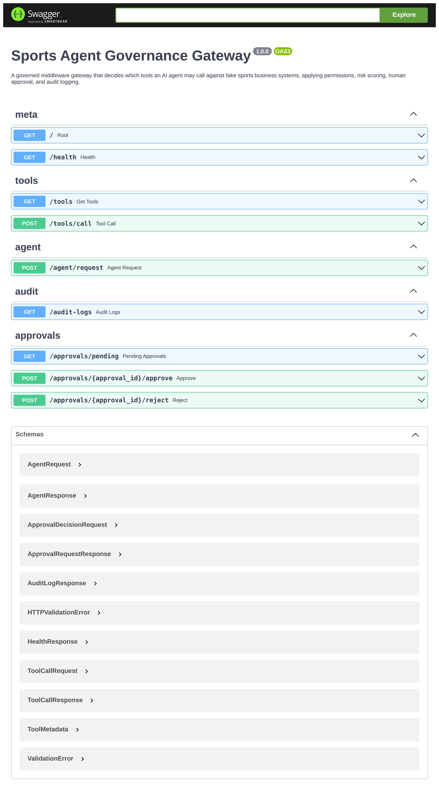
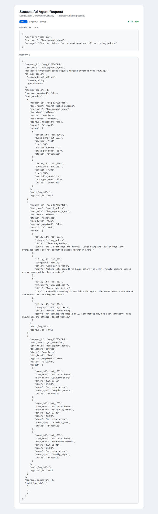
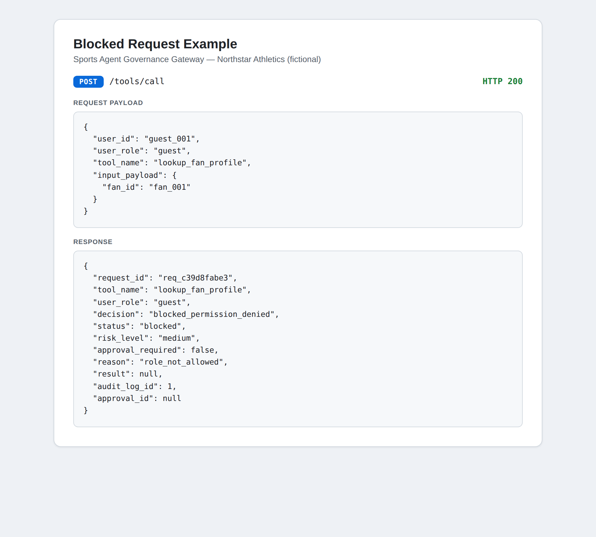
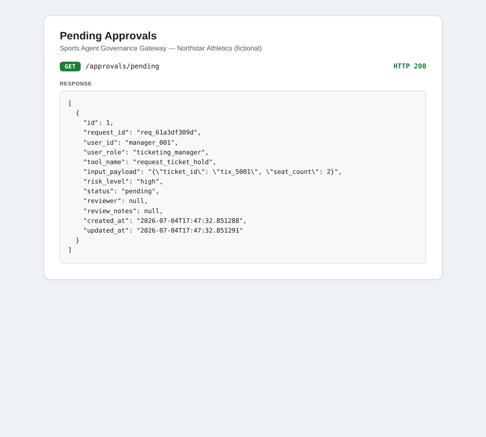
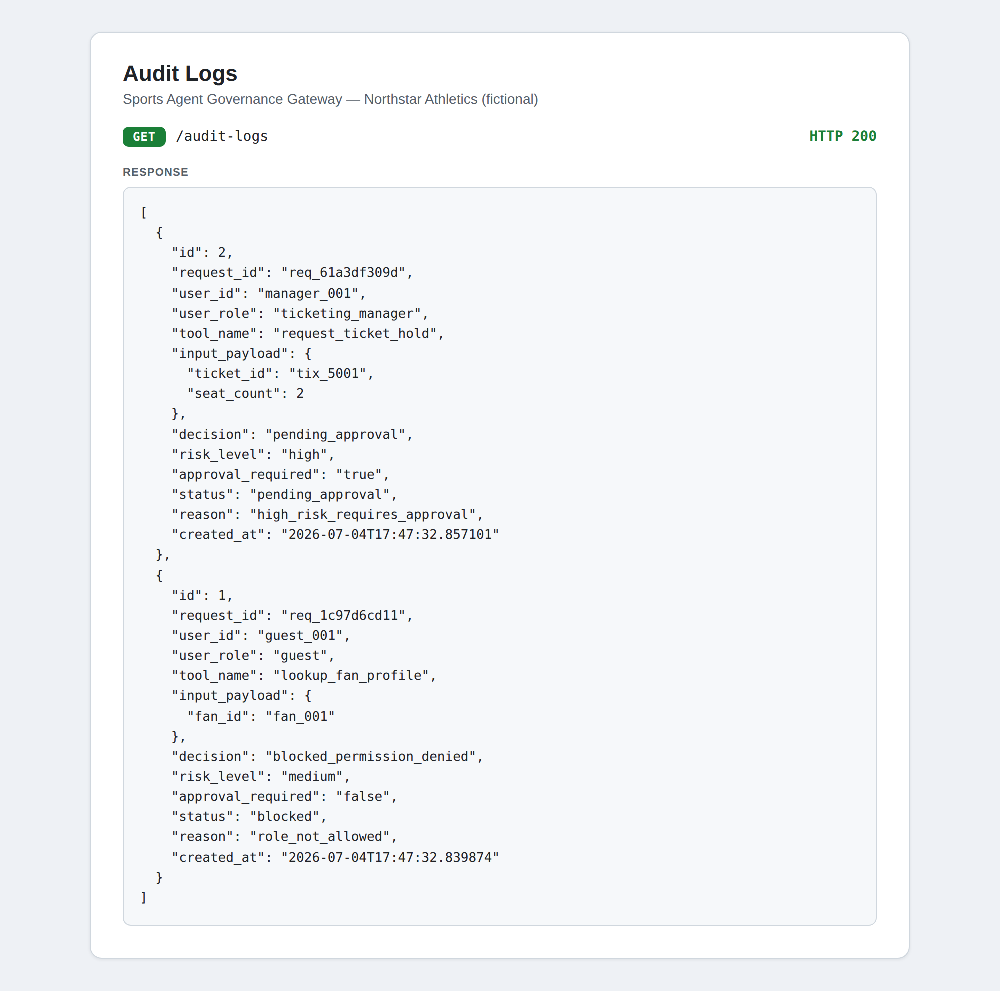

# Sports Agent Governance Gateway

A portfolio-level backend project that simulates how a sports organization could safely let AI agents interact with business systems such as ticketing, schedules, content libraries, fan profiles, and venue policies.

> **Core idea:** AI agents should not have unrestricted access to business systems. They need permissions, tool boundaries, audit logs, risk scoring, and human approval for sensitive actions.

The project is built around a **fictional** sports organization called **Northstar Athletics**. It does **not** use real client data, real sports team data, or real ticketing APIs. All data is fake and generated inside this repository.

---

## What it does

Instead of letting an agent call any system directly, this gateway decides:

* what tools the agent can call
* whether the user's role has permission
* whether the action is low, medium, or high risk
* whether human approval is required
* what gets logged for audit purposes
* what safe, structured response is returned

Every tool call flows through:

```text
permissions → risk scoring → approval routing → audit logging → execution
```

This makes the gateway a controlled middleware layer between an AI agent and simulated sports business systems.

---

## Architecture

```text
Agent / User Request
        |
        v
FastAPI API Layer
        |
        v
Gateway Router
        |
        ├── Tool Registry      (which tools exist + metadata)
        ├── Permission Check    (can this role call this tool?)
        ├── Risk Scoring        (low / medium / high)
        ├── Approval Routing    (high-risk -> human approval queue)
        └── Audit Logging       (every decision is recorded)
        |
        v
Approved Tool Execution
        |
        v
Structured Response
```

See [`docs/architecture.md`](docs/architecture.md) for a layer-by-layer explanation and [`docs/governance_model.md`](docs/governance_model.md) for the governance rules.

---

## Roles

| Role                | Allowed behavior                                        |
| ------------------- | ------------------------------------------------------- |
| `guest`             | Search public schedule and venue policies               |
| `fan_support_agent` | Search policies, tickets, schedule, and draft responses |
| `content_editor`    | Search content records and classify visual assets       |
| `ticketing_manager` | Search tickets/schedule and request ticket holds        |
| `admin`             | Access all tools, approvals, and audit logs             |

---

## Tools and risk levels

| Tool                    | Risk   | Approval required |
| ----------------------- | ------ | ----------------- |
| `get_schedule`          | low    | no                |
| `search_policy`         | low    | no                |
| `search_content`        | low    | no                |
| `lookup_fan_profile`    | medium | no, but logged    |
| `search_ticket_options` | medium | no                |
| `draft_fan_response`    | medium | no                |
| `classify_visual_asset` | medium | no                |
| `request_ticket_hold`   | high   | yes               |

> **Note on the vision tool:** This repo does not run a PyTorch model directly.
> The `classify_visual_asset` tool simulates a governed call to an external
> PyTorch vision service, matching the separate multimodal vision pipeline
> project. It uses fake visual asset data only and adds no CV dependencies here.

---

## Tech stack

* Python 3.10+
* FastAPI
* Uvicorn
* Pydantic
* SQLAlchemy
* SQLite by default
* Pytest
* Docker
* Docker Compose

No paid LLM APIs are required. Version 1 uses deterministic keyword routing and rule-based agent simulation so the project can run fully locally.

---

## Quickstart

```bash
python -m venv venv
source venv/bin/activate
pip install -r requirements.txt

# Optional: create tables and print a fake-data summary
python -m scripts.seed_data

# Run the API
uvicorn app.main:app --reload
```

Open the interactive API docs:

```text
http://localhost:8000/docs
```

Run the tests:

```bash
pytest
```

Run with Docker:

```bash
docker compose up --build
```

---

## API endpoints

| Method | Path                               | Description                        |
| ------ | ---------------------------------- | ---------------------------------- |
| GET    | `/`                                | Service metadata                   |
| GET    | `/health`                          | Health check                       |
| GET    | `/tools`                           | List registered tools and metadata |
| POST   | `/agent/request`                   | Natural-language agent request     |
| POST   | `/tools/call`                      | Single governed tool call          |
| GET    | `/audit-logs`                      | Recent audit logs                  |
| GET    | `/approvals/pending`               | Pending approval requests          |
| POST   | `/approvals/{approval_id}/approve` | Approve a pending request          |
| POST   | `/approvals/{approval_id}/reject`  | Reject a pending request           |

Full curl examples are available in [`docs/api_examples.md`](docs/api_examples.md).

---

## Screenshots

### API documentation

The FastAPI Swagger UI exposes the governed agent, tool-call, audit, and approval endpoints.



---

### Successful governed agent request

A fan support agent asks for tickets and venue policy information. The gateway routes the request through allowed tools and returns a structured response.



---

### Permission denied example

A guest attempting to access a protected fan profile is denied by the permission layer.



---

### Human approval queue

A high-risk ticket hold request is routed to the approval queue instead of executing directly.



---

### Governance audit trail

Every gateway decision is recorded for traceability, including blocked requests and approval-routed actions.



---

## Example: agent request

```bash
curl -X POST http://localhost:8000/agent/request \
  -H "Content-Type: application/json" \
  -d '{
    "user_id": "user_123",
    "user_role": "fan_support_agent",
    "message": "Find two tickets for the next game and tell me the bag policy."
  }'
```

The gateway routes this request through the allowed tools for schedule, ticket search, and policy lookup.

---

## Example: blocked request

A guest user trying to access a fan profile should be denied.

```bash
curl -X POST http://localhost:8000/tools/call \
  -H "Content-Type: application/json" \
  -d '{
    "user_id": "guest_001",
    "user_role": "guest",
    "tool_name": "lookup_fan_profile",
    "input_payload": {
      "fan_id": "fan_001"
    }
  }'
```

Expected decision:

```json
{
  "decision": "blocked_permission_denied",
  "status": "blocked"
}
```

---

## Example: high-risk action routed for approval

A ticketing manager can request a ticket hold, but the action is high risk and requires approval.

```bash
curl -X POST http://localhost:8000/tools/call \
  -H "Content-Type: application/json" \
  -d '{
    "user_id": "manager_001",
    "user_role": "ticketing_manager",
    "tool_name": "request_ticket_hold",
    "input_payload": {
      "ticket_id": "tix_5001",
      "seat_count": 2
    }
  }'
```

Expected decision:

```json
{
  "decision": "pending_approval",
  "approval_required": true,
  "status": "pending_approval"
}
```

---

## Example: classify a visual asset

A content editor classifies a fake visual asset through a governed call to a
simulated external PyTorch vision service.

```bash
curl -X POST http://localhost:8000/tools/call \
  -H "Content-Type: application/json" \
  -d '{
    "user_id": "editor_001",
    "user_role": "content_editor",
    "tool_name": "classify_visual_asset",
    "input_payload": {
      "asset_id": "asset_001"
    }
  }'
```

---

## View pending approvals

```bash
curl http://localhost:8000/approvals/pending
```

---

## View audit logs

```bash
curl http://localhost:8000/audit-logs
```

---

## Project structure

```text
app/        FastAPI app, config, database, models, schemas, CRUD
gateway/    tool registry, permissions, risk scoring, audit, approvals, router
tools/      simulated business-system tools backed by fake JSON data
data/       fake JSON data for schedule, policies, tickets, fans, and content
scripts/    seed / initialization helper
tests/      pytest suite
docs/       architecture, governance model, API examples, fake data notes
```

---

## Fake data disclaimer

All data is fictional.

**Northstar Athletics** is an invented organization. No real team, league, venue, ticketing system, CRM, or fan data is used.

See [`docs/fake_data.md`](docs/fake_data.md) and [`data/README.md`](data/README.md) for details.

---

## Design goals

This project is designed to show:

* governed AI tool access
* role-based permission checks
* risk-aware execution
* human-in-the-loop approval for sensitive actions
* auditability for every agent action
* modular backend architecture
* sports business workflow simulation using fake data

The main focus is not the language model itself. The focus is the control layer around agent actions.

---

## Limitations

This project is intentionally scoped as a local portfolio system.

It does not currently include:

* real authentication
* real ticketing APIs
* real CRM integration
* real payment actions
* external LLM tool-calling
* production deployment configuration
* real fan or customer data
* a real PyTorch vision model (the visual asset tool is a governed adapter to a simulated external service)

The current version uses deterministic routing so it can run without API keys or external services.

---

## Future improvements

* Add LangGraph for explicit workflow routing
* Add Claude or OpenAI tool-calling integration
* Add JWT authentication
* Add real RBAC middleware
* Add PostgreSQL support
* Add pgvector for policy/content search
* Add a React dashboard for approvals
* Add Slack or email approval notifications
* Add rate limiting
* Add OpenTelemetry tracing
* Deploy to Render, Railway, or AWS ECS
